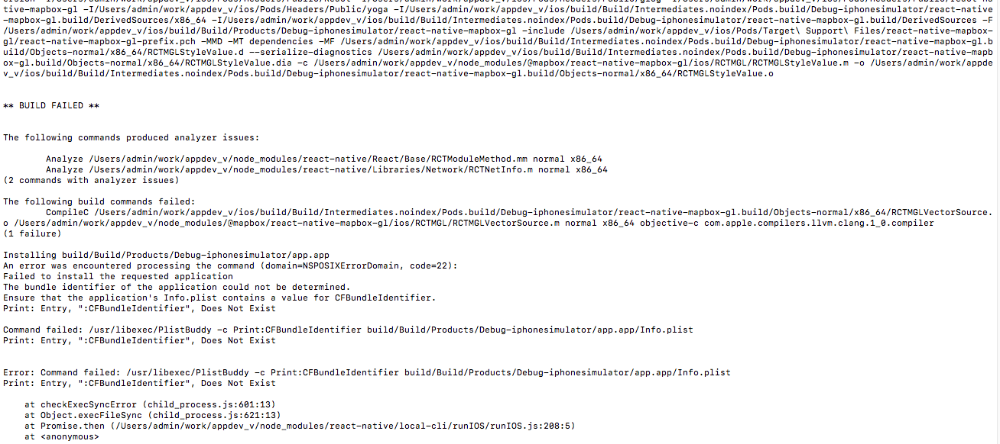

# APP MVP


#### How to run the project

```
yarn install
```

#### How to run on iOS simulator
```
react-native link
cd ios && pod install
cd ..
react-native run-ios
```
If you have `CFBundleIdentifier error`, please delete the ios/build folder and run `react-native run-ios` again.
If you got following error while building, please run these commands.

```
cd ios && pod update
cd ..
rm -rf ios/build
react-native run-ios
```

#### How to run on Android
```
react-native run-android
```

You could also run android app, debugger and bundle in one terminal window by running the command `yarn android`.

#### How to run on real iOS device.

1. Open the project with the `./ios/app.xcodeproj` file.
2. Check `Automatically manage signing` and add your Apple ID.
3. Select connected device.


4. Run `Play`.

The flow will be changed as we'll have different environment builds / push notifications / build automation.

#### How to build production version for Android

- Add local.properties file to ./android and add below line.

```
sdk.dir=/Users/username/Library/Android/SDK
```

- Run npm script

```
npm run android-build-prod
```

#### How to setup VS Code

1. Install plugin [flow-for-vscode](https://github.com/flowtype/flow-for-vscode).
2. Set `javascript.validate.enable` option to false or completely disable the built-in TypeScript extension for your project

#### Running issues

- `yarn android` doesn't works sometime.


To fix this issue and run the app on android device, run the common script for react-native.

```
react-native run-android
```

Open the web browser and type address for debugger. http://your_ip:8081/debugger-ui


